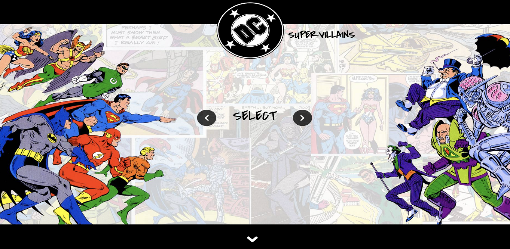
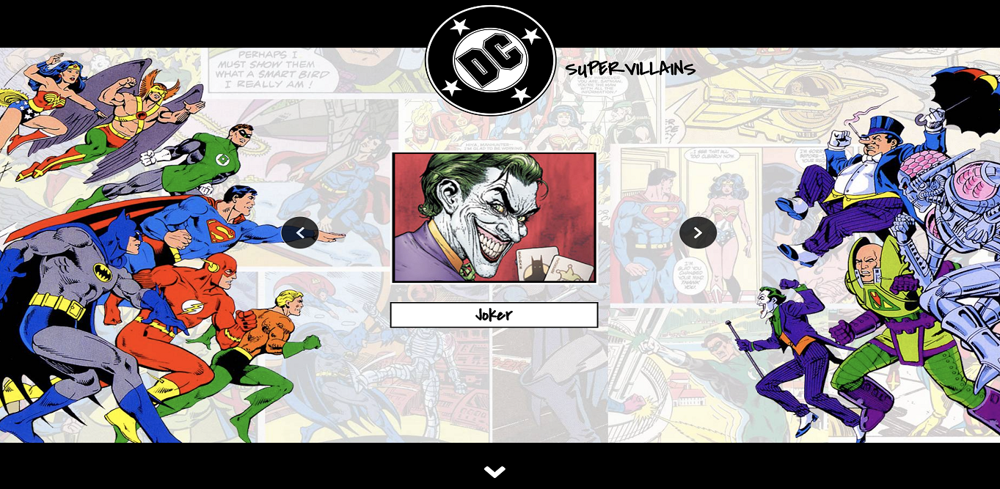
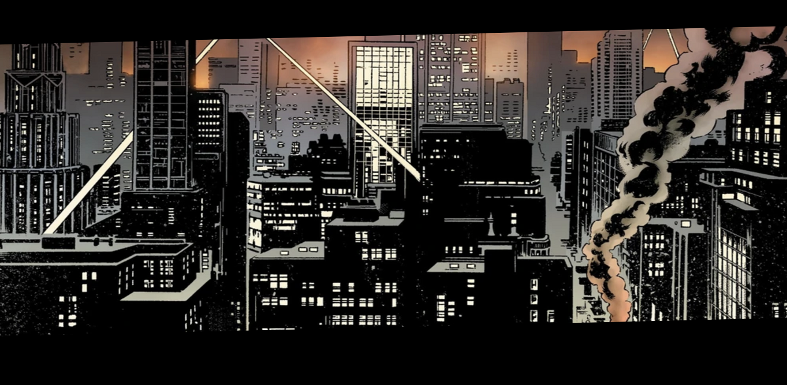
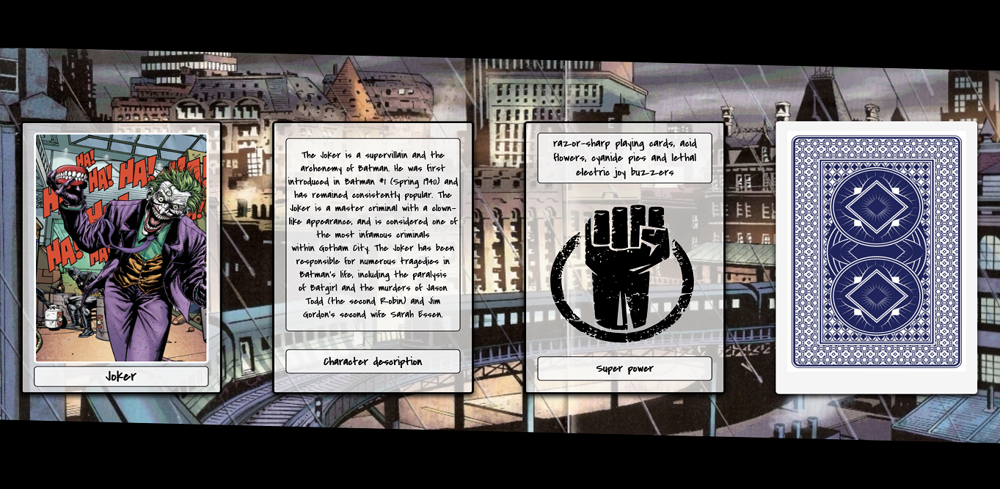
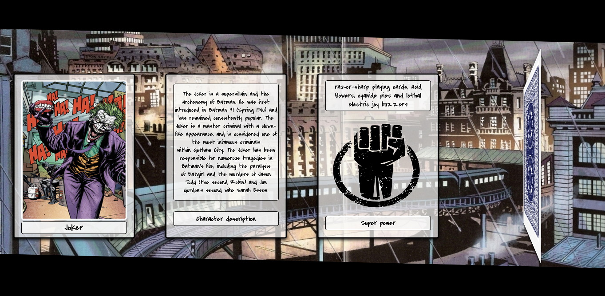
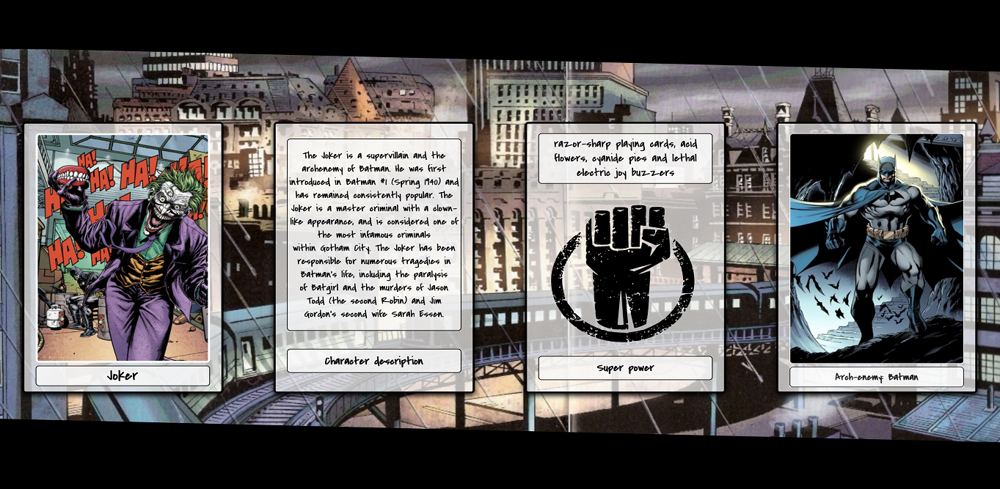
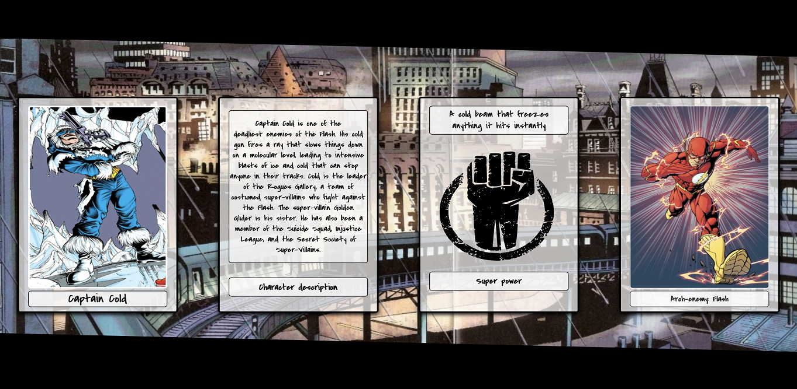
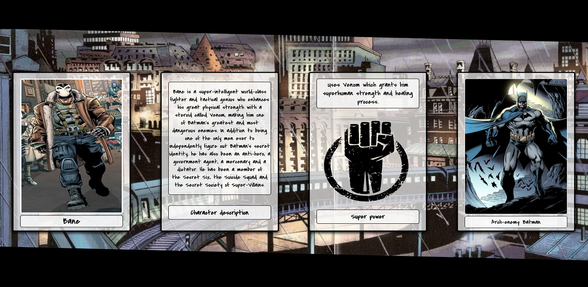

DC Supervillains
================
Using React to create a DC Supervillains wiki application. It handles the API calls to self-made REST API (https://github.com/MarcinBalejko/supervillain-rest-api). User can select one of the supervillains from the database and learn some basic information about them.

Tools and technologies used:

* React
* JavaScript
* Axios
* HTML / CSS

-----

|   Description   |   Image    |
|:------------:|:----------------:|
|User enters the main page| |
|User can select a supervillain by clicking the arrow buttons| |
|User can scroll down to view the supervillain's information| |
|Supervillain overview part| |
|The card on the right end of the page flips on hover| |
|The card on the right reveals supervillain's Arch-enemy| |
|Each supervillain has his own Arch-enemy| |
|Each supervillain has also different description and super powers. All of these pieces of information are taken from database| |

-----
